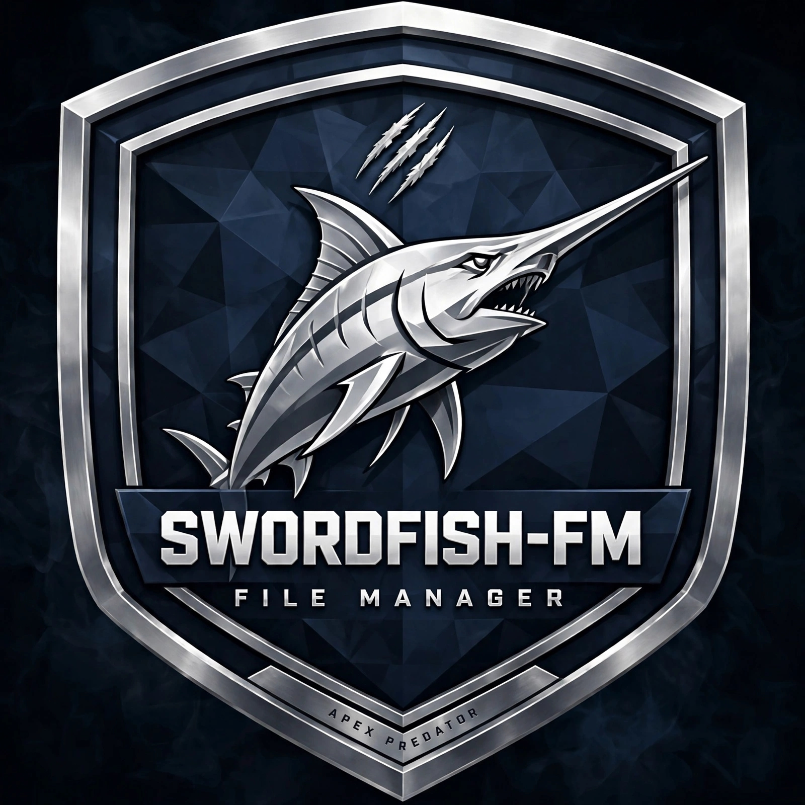
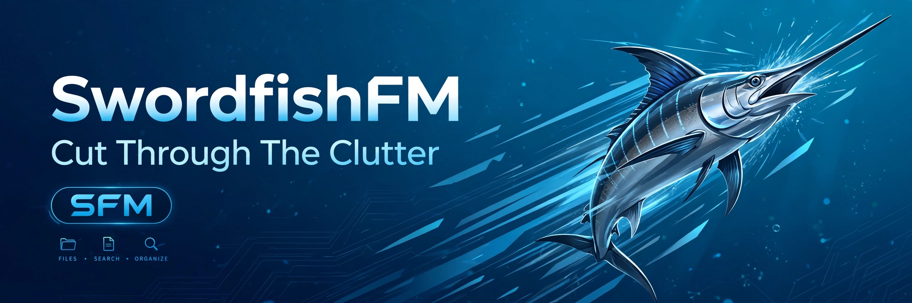

  

# Swordfish FM

> **⚠️ Work in Progress - Not ready for release yet**
> About the name **SwordFish**, XFE file anger is known for its speed and versatility, ad I am a life long avid angler, I wanted to choose a name that reflects both the ethos of XFE, and combine with my hobby, Swordfish is one of the fastest and most agile top ocean predators, hence the name
> I hope SwordFish-FM will live up to expectations and saisfies your needs.

## 🙏 Credits & Acknowledgments

Swordfish FM is based on **Xfe (X File Explorer)** — a lightweight file manager for X11.

- **Original Author & Maintainer of Xfe:** [Roland Baudin (roland65)](https://github.com/roland65/xfe)
- **Based on:** X Win Commander by Maxim Baranov
- **Homepage:** http://roland65.free.fr/xfe/

All credit for the original Xfe codebase goes to Roland. Swordfish FM is a modern continuation / fork inspired by his work.

## 📜 License

This project is based on Xfe, which is licensed under the **GNU General Public License v2.0 (GPLv2)**.

- Original Xfe License: GPLv2
- Swordfish FM will maintain GPLv2 compatibility.

See [COPYING](COPYING) for full details..
Copyright (C) Roland Baudin and contributors.

> If Xfe is the root, Swordfish FM aims to be the evolution.
